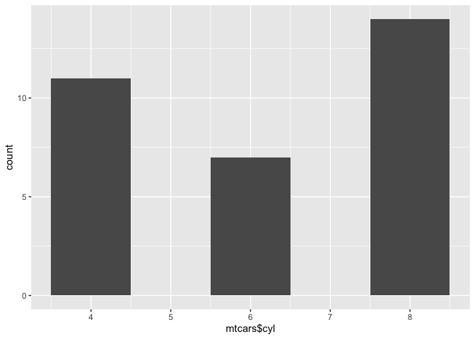

<!-- README.md is generated from README.Rmd. Please edit that file -->

# assignmentb1andb2haleymac

<!-- badges: start -->
<!-- badges: end -->

The goal of assignment-b1-and-b2-haleymac is to provide a function
called histogram_maker() that creates histograms from specified data
frame columns with a customizable bin width.

## Installation

You can install the development version of assignment-b1-and-b2-haleymac
like so:

``` r
install_github("stat545ubc-2022/assignment-b1-and-b2-haleymac", ref = "0.1.1")
```

Note to use the package in your current environment call it with no
dashes, like so:

``` r
library(assignmentb1andb2haleymac)
```

## Example

This is a basic example of how to use the histogram_maker function:

``` r
library(assignmentb1andb2haleymac)

histogram_maker(mtcars, mtcars$cyl, 1)
```


