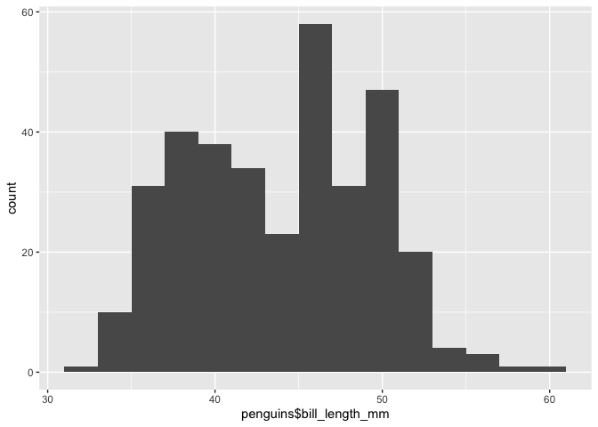
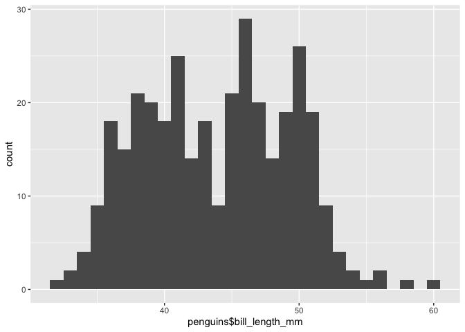
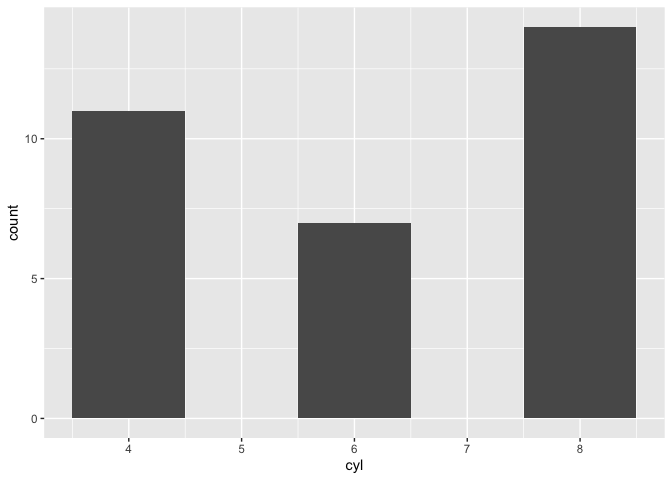

assignment-b1
================
2022-11-03

``` r
library(devtools)
library(dplyr)
library(palmerpenguins)
library(ggplot2)
library(testthat)
```

# Exercise 1: Make a Function and Exercise 2: Document your Function

I have made a function that will create a histogram from a specified
categorical variable in a dataset, with a customizable bin size. I have
added additional error messages that will provide more information if
the user inputs the wrong type of argument into the function.

``` r
#' @title Histogram Creator
#' @description Creates a histogram from a dataset column with a user-specified bin width 
#' @param datafr data frame used in histogram creation - called datafr for readability 
#' @param histo_variable Column of data frame used in histogram creation. Must be in dataframe$columnname format. Must be quantitative variable. Called histo_variable for readability 
#' @param bin_width Bin width to be used for creation of histogram. Called bin_width for readability. 
#' @return a ggplot histogram of the dataframe column specified 
#' @examples 
#' histogram_maker(mtcars, mtcars$cyl, 1)
#' histogram_maker(mtcars, mtcars$drat, 0.2)


histogram_maker <- function(data_fr, histo_variable,  bin_width) 
  {
  if(!class(histo_variable) == "numeric") {
    stop('This function only takes a continuous variable for the histo_variable argument. You have supplied a categorical variable.')
  }
  if(!class(bin_width) == "numeric" | (length(bin_width) > 1 | length(bin_width) < 1)) {
    stop('The bin_width argument in this function takes only numeric inputs containing 1 element.', 'You have supplied an object of class: ', class(bin_width), ', containing ', length(bin_width), ' element(s).')
  }
  histo_variable_label_title <- deparse(substitute(histo_variable))
  histo_plot <- data_fr %>%
    ggplot(aes(histo_variable)) +
    geom_histogram(binwidth = bin_width) +
    xlab(histo_variable_label_title)
  return(histo_plot)
  print(histo_plot)
}
```

# Exercise 3: Include examples

The following codeblocks show examples of the use of this function to
create histograms from the palmerpenguins and mtcars datasets:

``` r
# Here I use the histogram_maker function to create a histogram of the bill_length_mm data from the penguins dataset with a bin width of 2
histogram_maker(penguins, penguins$bill_length_mm, 2)
```

<!-- -->

``` r
# Here I use the histogram_maker function to create the same histogram as above, but with a bin width of 1 instead
histogram_maker(penguins, penguins$bill_length_mm, 1)
```

<!-- -->

``` r
# Here I define the cyl data from the mtcars dataset as its own object, and then use the histogram_maker function to create a histogram from this object

cyl <- mtcars$cyl
mtcars_histo <- histogram_maker(mtcars, cyl, 1)
mtcars_histo
```

<!-- -->

# Exercise 4: Test the Function

In the following codeblock I test the function in several ways: 1. Test
to make sure the function is outputting a plot. 2. Test to make sure
that the plot has a GeomBar layer (ensuring it is a histogram). 3. Test
to see if my custom error message displays when a user attempts to use
function on a categorical variable.

``` r
test_that("histogram_maker", {
  mtcars_histo <- histogram_maker(mtcars, mtcars$cyl, 1)
  expect_equal(class(mtcars_histo), c("gg", "ggplot"))
  expect_true("GeomBar" %in% class(mtcars_histo$layers[[1]]$geom))
  expect_error(histogram_maker(penguins, penguins$island, 1), 'This function only takes a continuous variable for the histo_variable argument. You have supplied a categorical variable.')
})
```

    ## Test passed 😀
